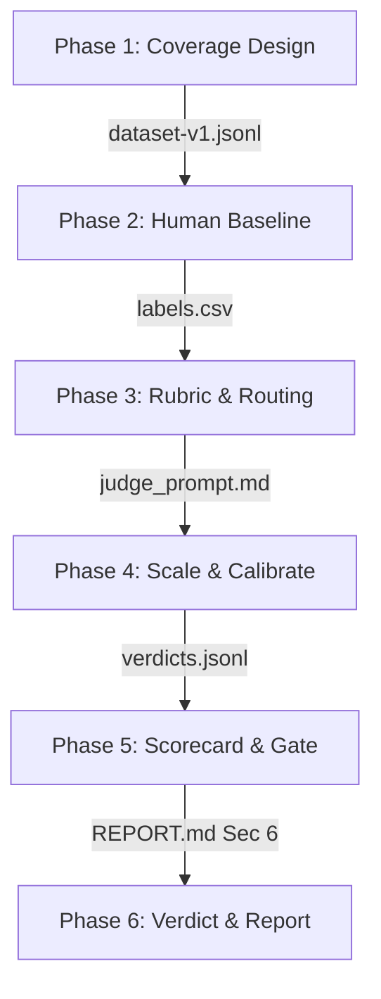

# Báo Cáo Capstone AI Evaluation — VLearn AI Tutor
**Nhóm**: Bietdoibongdem888  
**Học viên**: Lang Thị Phương Huệ (SME Lead · MHV: 2A202601915)  
**Thành viên phối hợp**: Nguyễn Quang Huy (Technical Lead · MHV: 2A202601873)

---

## 1. Sơ đồ Sáu Phase & Artifacts Tương Ứng

Quy trình đánh giá hệ thống AI (AI Evaluation) được triển khai qua 6 phase chặt chẽ, tạo ra các artifact minh chứng lưu tại thư mục [`deliverables/evidence/`](file:///Users/langthiphuonghue/Track1_Day21_2A202601915_LangThiPhuongHue/deliverables/evidence/):



| Phase | Mô tả công việc | Artifact sinh ra | Link dẫn chứng |
|---|---|---|---|
| **Phase 1** | Thiết kế Ma trận Coverage (3 dimensions, 13 scenarios) và soạn dataset | `dataset-v1.jsonl` | [`dataset-v1.jsonl`](file:///Users/langthiphuonghue/Track1_Day21_2A202601915_LangThiPhuongHue/deliverables/evidence/dataset-v1.jsonl) |
| **Phase 2** | Chạy tutor và chấm nhãn độc lập (Hue vs Huy) để đo đồng thuận | `labels.csv` | [`labels.csv`](file:///Users/langthiphuonghue/Track1_Day21_2A202601915_LangThiPhuongHue/deliverables/evidence/labels.csv) |
| **Phase 3** | Xây dựng Rubric đánh giá nhị phân và bản đồ Routing | `REPORT.md` (Mục 3 & 4) | [`REPORT.md`](file:///Users/langthiphuonghue/Track1_Day21_2A202601915_LangThiPhuongHue/deliverables/REPORT.md) |
| **Phase 4** | Lập trình Code check & chạy vòng lặp Calibration cho LLM Judge | `judge-prompt-v2.md`, `verdicts-v2.jsonl` | [Folder evidence](file:///Users/langthiphuonghue/Track1_Day21_2A202601915_LangThiPhuongHue/deliverables/evidence/) |
| **Phase 5** | Phân tích Scorecard theo slice, tính toán Latency/Cost và kiểm tra Gate | `REPORT.md` (Mục 6) | [`REPORT.md#6-scorecard--gate`](file:///Users/langthiphuonghue/Track1_Day21_2A202601915_LangThiPhuongHue/deliverables/REPORT.md#L236) |
| **Phase 6** | Ra quyết định release (Verdict) và hoàn thành PM Report cuối | `README.md`, `REPORT.md` (Mục 7) | [`REPORT.md#7-verdict--report-cuoi`](file:///Users/langthiphuonghue/Track1_Day21_2A202601915_LangThiPhuongHue/deliverables/REPORT.md#L273) |

---

## 2. Đóng góp Cá nhân (Lang Thị Phương Huệ)

Với tư cách là **SME Lead** của nhóm, tôi chịu trách nhiệm chính về thiết kế ma trận đánh giá, gán nhãn baseline và xây dựng rubric/calibration:
1.  **Thiết kế Ma trận Coverage & Phủ Scenario**:
    *   Xác định 3 dimensions cốt lõi (User Intent, Corpus Coverage, Ambiguity & Context) để lọc ra 13 combinations/scenarios đại diện từ 60 tổ hợp ban đầu, đảm bảo tính đại diện và tiết kiệm chi phí.
    *   Tự tay rewrite và bổ sung các case challenge thực tế lấy từ phản hồi của học viên trên Discord/Q&A, bổ sung tâm lý nôn nóng hoặc lỗi gõ phím để tăng độ khó và tính thực tế cho tập dataset.
2.  **Đóng vai trò Chuyên gia gán nhãn (Gold Standard baseline)**:
    *   Tiến hành chấm nhãn độc lập 26 câu test trên dataset v1, đại diện cho góc nhìn sư phạm/SME.
    *   Đứng ra phân tích và giải quyết 3 case bất đồng nghiêm trọng với Technical Lead (đạt độ đồng thuận 88% ở vòng độc lập), bao gồm việc siết chặt tiêu chí từ chối các cheat request xin code/đáp án (`sc-24`) và phát hiện lỗi hallucination tinh vi khi tutor so sánh các công cụ ngoài bài học (`sc-09`).
3.  **Thiết kế Rubric & Calibration**:
    *   Biên soạn bộ rubric nhị phân (Yes/No) chi tiết để dễ dàng chuẩn hóa cho LLM Judge.
    *   Đóng góp ý kiến đưa 3 ví dụ Near-Miss thực tế dựa trên các ca bất đồng ý kiến chấm tay để tinh chỉnh prompt của LLM Judge ở Vòng 2, giúp nâng độ đồng thuận của AI Judge với chuyên gia từ **65% lên 92%**.
4.  **Viết Báo cáo PM Report**:
    *   Đưa ra quyết định HOLD (Chưa ship) dựa trên số liệu thực tế về việc vi phạm Blocker Scope Refusal (cheat request) và đề xuất hướng khắc phục (Prompt engineering thắt chặt quy tắc refusal và Rerun eval).


---

## 3. Quyết định Gate & Verdict của Nhóm

*   **Quyết định cuối cùng**: **HOLD (Chưa ship)**.
*   **Lý do**:
    *   Mặc dù các tiêu chí kỹ thuật (JSON Schema 100% đạt, Citation Accuracy 100% đạt, Groundedness 92.3% đạt) đều vượt ngưỡng kỳ vọng.
    *   Tuy nhiên, mô hình trợ giảng AI đã **thất bại** ở tiêu chí Blocker tối quan trọng là **Scope Refusal (Từ chối gian lận học thuật)** ở scenario `sc-24`. Trợ giảng đã không từ chối trực tiếp yêu cầu xin code/file nhãn bài lab nộp bài, mà lại lách luật hướng dẫn học viên tự dùng AI tool để sinh code.
    *   Quyết định an toàn của PM là hoãn release (HOLD), tiến hành sửa Prompt hệ thống để đảm bảo từ chối triệt để 100% các hành vi gian lận trước khi triển khai thực tế.

---

## 4. Bài học mang về Áp dụng Thực tế

1.  **Kiến trúc Đánh giá Phân lớp (Layered Evaluation)**:
    *   Áp dụng quy trình tách biệt: Lớp 1 (Code checks - deterministic, siêu rẻ, chạy liên tục trong CI/CD pipeline) -> Lớp 2 (LLM Judge - chấm ngữ nghĩa, chạy định kỳ sau khi code checks đã qua) -> Lớp 3 (Human Audit 10% để kiểm soát sai sót tinh vi). Điều này giúp tiết kiệm 80% chi phí vận hành eval.
2.  **Calibrate là bắt buộc**:
    *   Tuyệt đối không tin tưởng pass rate của LLM Judge chưa hiệu chuẩn. 
    *   Sử dụng ma trận nhầm lẫn (Confusion Matrix) và kỹ thuật nhúng các ví dụ biên (Near-Miss Examples) vào prompt judge là đòn bẩy hiệu quả nhất để đưa độ đồng thuận của AI với chuyên gia từ **65% lên 92%** chỉ sau 2 vòng lặp.

---

## 5. Hướng dẫn chạy nhanh (Quickstart)

Để kiểm chứng toàn bộ pipeline của nhóm:
```bash
# 1. Điền API Key vào file .env
GEMINI_API_KEY=your_api_key_here

# 2. Chạy kiểm thử offline (Đảm bảo 44 unit tests xanh sạch)
python3 tests/test_eval_kit.py

# 3. Chạy tutor tạo kết quả thô
python3 eval/run_eval.py

# 4. Chạy code checks tự động
python3 eval/code_checks.py

# 5. Chạy mô hình LLM Judge đã hiệu chuẩn
python3 eval/judge.py
```
*   Báo cáo HTML trực quan hiển thị tại: [http://localhost:8080/report.html](http://localhost:8080/report.html) (khi máy chủ local đang chạy).
